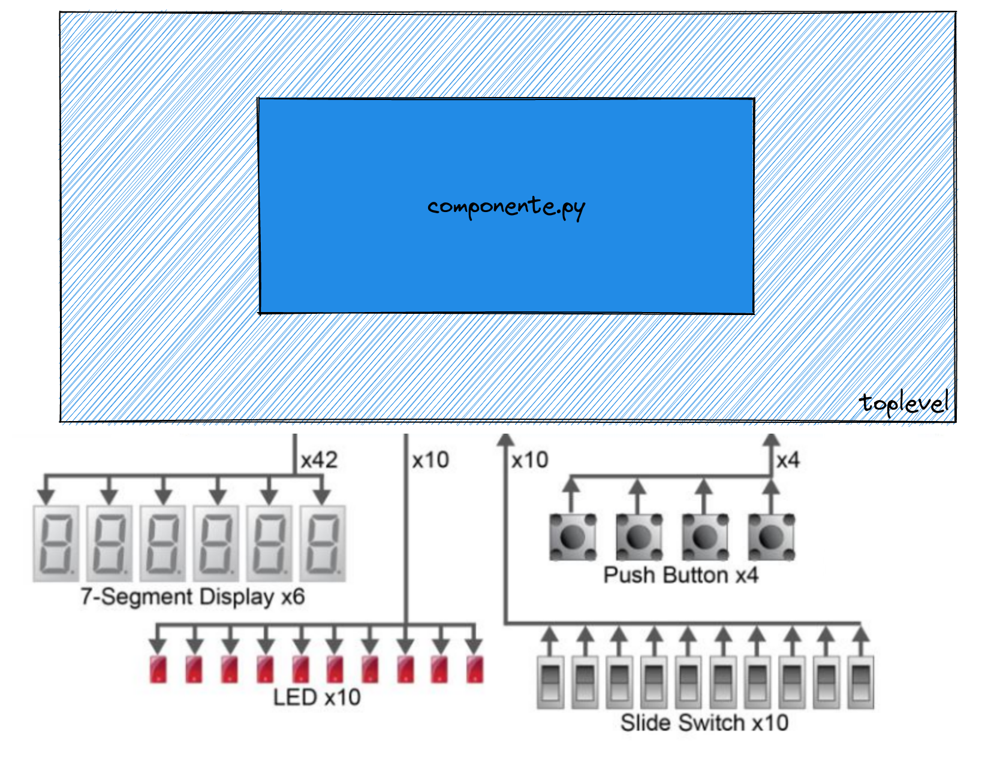

# Lab 5: MyHDL

Leitura prévia necessária:

- `MyHDL/MyHDL Básico`
- `Teoria/FPGA` (TODO)

Este laboratório é introdutório para o desenvolvimento do projeto ([`Lógica-Combinacional`](/bits-e-proc/class/logiComb-Projeto)), onde iremos criar componentes de hardware que serão os alicerces do nosso computador. Primeiro precisamos praticar um pouco de `MyHDL` e entender a ferramenta e o fluxo de compilação, teste e como conseguimos executar o hardware em uma FPGA.

Os exercícios dos laboratórios estão localizados no repositório:  https://github.com/insper/bits-e-proc-labs, cada aluno de forma individual deve realizar um fork do repositório e trabalhar individualmente nele. Os laboratórios não po ffssuem entregas, mas devem ser realizados para estudo.

!!! exercise
    1. Realize um fork do repositório de labs (https://github.com/insper/bits-e-proc-labs)
    1. Clone o repositório para a sua máquina
    
!!! exercise
    Nós iremos trabalhar sempre com um ambiente virtual do python 3.8, para isso será necessário realizar as seguintes operações ==dentro da pasta clonada==:

    ```
    python3.8 -m venv env
    . env/bin/activate
    pip3 install -r requirements.txt
    ```

!!! warning 
    Sempre que for abrir um terminal novo e acessar a pasta, será necessário ativar o ambiente virtual:
   
    ```
    . env/bin/activate
    ```
    
    Se for utilizar o VSCODE para fazer o desenvolvimento dos projetos e exercícios, basta abrir a pasta raiz do repositório que o code já utiliza o ambiente virtual (eu criei o arquivo `.vscode/settings.json` que configura isso.)
    
### pytest

Bits e Processadores utiliza uma metodologia de desenvolvimento de projeto chamada de **test driven development (TDD)**, ou seja, para cada etapa do projeto teremos um teste associado a ele. Os testes podem ser do tipo unitário e de integraćão. Para realizarmos os testes em python utilizaremos o módulo `pytest` e o plugin de dev-life (para fazer o report do progresso de vocês para o servidor).

Cada exercício possui um arquivo com o prefixo `test_` que excita o componente que vocês irão desenvolver e valida a saída esperada.

A seguir um exemplo do teste falhando e então solucionado e testado novamente:

<script id="asciicast-DL3cuBQSgSgIyXdZK2LVBolgr" src="https://asciinema.org/a/DL3cuBQSgSgIyXdZK2LVBolgr.js" async></script>

!!! exercise
    1. Navegue no terminal até a pasta `comb`
    1. Execute no terminal `pytest -k exe1`
    
    O teste deve falhar pois não foi implementado ainda.
    
    Edite o arquivo `comb_modules.py` com a lógica a seguir:
    
    ```diff
    def exe1():
    -    pass
    +    q.next = a or (and b)
    ```
    
    Execute o `pytest` novamente e note que o código passa no teste.
    
    
!!! info
    Todo o teste executado no repositório será submetido ao servidor de dev-life para processamento futuro e acompanhamento individual da participacão de vocês nos projetos. Portanto, facam individualmente os laboratórios.
    
!!! progress
    Começando o laboratório.
    
## Praticando - Parte 1

Vamos comecar descrevendo algumas circuitos lógicos combinacionais bem simples em MyHDL. 

!!! exercise
    Para cada exercício implemente a solução no arquivo `comb_modules.py` e teste com `pytest`. A descrição do exercício está no próprio módulo.

    - `exe2()`  teste: `pytest -k exe2`
    - `exe3()`  teste: `pytest -k exe3`

!!! progress
    Continuar...

## Executando na FPGA

Agora vamos entender como conseguimos usar o nosso hardware descrito em `MyHDL` em um hardware real (FPGA), para isso temos que primeiro converter o `MyHDL` para `VHDL` e então usar a ferramenta da Intel (Quartus) para **sinterizar** o nosso hardware. Depois disso temos que programar a FPGA, a seguir temos uma visão simplificada do fluxo:

```
   toplevel.py   ---> toplevel.vhd ---> Makefile ---> .sof ---> FPGA
       ^                                   ^
       |                                   |
    componente.py                        Quartus
```

Notem que agora o nosso módulo precisa ler e acionar pinos (interface com o mundo externo), normalmente a última camada de um projeto de hardware (aquela que realmente acessa os pinos) é chamada de toplevel. Os pinos dessa camada possuem nomes fixos, por isso temos que mapear os pinos do HW para os sinais do nosso módulo. Nessa primeira etapa iremos utilizar os seguintes componentes da nossa placa:



Onde:

- `LED`: 10 leds que acendem com lógica `1`
- `Push Buttons`: 4 botões que quando apertados fornecem lógica `0`
- `Slide Switchs`: 10 Slides que quando acionados forcem lógica `1`
- `HEX Displays`: 6 displays de 7 segmentos (anodo comum)

### Gerando `toplevel.vhd`

O programa `toplevel.py` faz o mapeamento do componente para os pinos da FPGA e gera o arquivo `toplevel.vhd` que será utilizado pelo Quartus para gerar o arquivo binário que irá ser programado na FPGA, a ideia desse módulo é mapear os sinais do componente para nomes e tamanhos fixos que serão utilizados pelo programa.

```py title="toplevel.py"
@block
def toplevel(LEDR, SW, KEY, HEX0, HEX1, HEX2, HEX3, HEX4, HEX5, CLOCK_50, RESET_N):
    ...
    
    ic1 = exe4(ledr_s, SW)
    
    ...

# pinos
LEDR = Signal(intbv(0)[10:]) # (1)
SW = Signal(intbv(0)[10:])
KEY = Signal(intbv(0)[4:])
HEX0 = Signal(intbv(1)[7:])
HEX1 = Signal(intbv(1)[7:])
HEX2 = Signal(intbv(1)[7:])
HEX3 = Signal(intbv(1)[7:])
HEX4 = Signal(intbv(1)[7:])
HEX5 = Signal(intbv(1)[7:])

# instance e generate vhd
top = toplevel(LEDR, SW, KEY, HEX0, HEX1, HEX2, HEX3, HEX4, HEX5)
top.convert(hdl="VHDL") # (2)
```
 
 1. Vetor de tamanho 10
 2. Aqui indicamos para o MyHDL gerar o vhdl a partir do componente `top`
 
Notem que os sinais criados são do tipo `Signal(intbv(0)[X:])`, isso indica que estamos manipulando um vetor de bits de tamanho **X**, no caso do LED, indicamos que o vetor é do tamanho 10, e no caso das KEY de tamanho 4. Com isso, podemos dentro do componente acessar individualmente cada um dos elementos do vetor:
 
 ```py title="comb_modules.py"
 @block
 def exe4(led, sw):
 @always_comb
 def comb():
     led[0].next = sw[0] and (not sw[1])

 return instances()
 ```
    
!!! info
    Notem que o `componente` recebe como argumentos os `ledr_s` e as chaves `SW` da FPGA e implementa a lógica `sw[0] and (not sw[1])`.

!!! exercise
    1. Analise o arquivo `toplevel.py`
    1. Execute o `toplevel.py` e note a geração do arquivo `toplevel.vhd`
    1. Analise o arquivo `toplevel.vhd`
    
    ```bash
    ./toplevel.py 
    ```

### Gerando `.sof`

O processo de gerar um hardware que posso ser executado na FPGA é complexo e até pouco tempo não existiam ferramentas opensource que fazem isso. Iremos utilizar um software da Intel chamado de Quartus que é capaz de sintetizar um hardware paras as FPGAs que a Intel possui, no nosso caso a Cyclone V. Para facilitar o desenvolvimento criamos um makefile que recebe como input a pasta do exercício e gera o `sof`. O projeto do quartus será o mesmo para todos os exercícios.

!!! tip
    O processo é demorado para quem está acostumado a apenas programar em python, a geracão do arquivo pode demorar alguns minutos.

!!! exercise
    Na raiz do repositório `comb/quartus`, execute:
    1. `make -C quartus clean`
    1. `make -c quartus all`
    1. Aguardem compilar
    1. Verifiquem que um novo arquivo `quartus/DE0_CV_Default.sof` foi gerado
    
### Programando FPGA

Agora com a FPGA plugada no computador podemos programar, para isso usaremos o comando `make program` que deve enviar para a ROM da FPGA o bitstream.

!!! exercise
    1. execute `make program`
    1. Mexa nas chaves 0 e 1 e notem o LED 0 obedece a equacao `sw0 and (not sw1)`
    
## Praticando - parte 2

Vamos praticar um pouco mais, agora usando a FPGA. Para cada um dos módulos a seguir, implemente o MyHDL e então execute na FPGA.

!!! exercise
    - Modulo: `exe5`
     
    Tarefa: 
    
    1. Implementar o módulo
    1. Edite o `toplevel` para incluir o `exe5`
    1. Gerar o `toplevel.vhd` rodando `toplevel.py`
    1. Compile o vhdl
        - `make -C quartus clean`
        - `make -C quartus all`.
        - `make -C quartus program`
    1. Validar na FPGA 
    
    Dica: 
    
    Você não pode ler uma saída `led[1].next = not led[0]`, para isso criei uma variável auxiliar:
    
    ```py
    led0 = sw[0]
    leds[0].next = led0
    leds[1].next = not led0
    ```

!!! exercise
    - Modulo: `sw2hex`
    
    Modifique o `toplevel.py` adicionando o módulo novo para acionar o `HEX0` controlado pelo `sw2hex`:
    
    ``` diff
    ic1 = exe5(ledr_s, SW)
    +ic2 = sw2hex(HEX0, SW)
    ```
    
    Lembre de validar na FPGA.
    
!!! exercise
    - Modulo: `bin2hex`
    
    Modifique o `toplevel.py` adicionando o módulo novo para acionar o `HEX1` controlado pelo `bin2hex`:
    
    ``` diff
    ic1 = exe5(ledr_s, SW)
    ic2 = sw2hex(HEX0, SW)
    +ic3 = bin2hex(HEX1, SW)
    ```
    
    Lembre de validar na FPGA.
