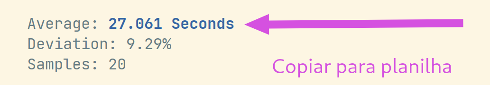

# Lab 1: Benchmark

!!! info "pensadeira"
    - Forncer um ssd com a infra já instalada?
    - Rodar testes no monstrão/ aws/ rasp3/ rasp4
    - Quais tipos de benchmark?
        - processamento
        - cache
        - acesso a disco
        - 

!!! warning
    Conecte o seu computador na tomada.

Neste laboratório iremos explorar os diferentes tipos de hardware existentes e qual o impacto no desempenho de alguns tipos de programa. Para isso iremos utilizar o [phoronix-test-suite](https://www.phoronix-test-suite.com/), que disponibiliza uma série de testes do https://openbenchmarking.org/.

## pre-lab

Instale o `Phoronix Text Suite`.

- Ubuntu: 

```
wget https://github.com/phoronix-test-suite/phoronix-test-suite/releases/download/v10.8.3/phoronix-test-suite_10.8.3_all.deb phoronix.deb
sudo dpkg -i phoronix.deb
sudo apt install -f
```

- Mac: 

```
brew install phoronix-test-suite
```

- Windows:

```
Instale o xampp (servidor PHP)
 https://www.apachefriends.org/pt_br/index.html

Baixe o zip do phoronix e extraia os arquivos:
 https://github.com/phoronix-test-suite/phoronix-test-suite/releases/download/v10.8.3/phoronix-test-suite-10.8.3.tar.gz
 
Execute o phoronix-test-suite.bat
```

## configurando

No terminal, execute:

```
 phoronix-test-suite batch-setup
```

E configure como indicado a seguir:

```
 Save test results when in batch mode (Y/n): n
 Open the web browser automatically when in batch mode (y/N): y
 Auto upload the results to OpenBenchmarking.org (Y/n): n
 Prompt for test identifier (Y/n): n
 Prompt for test description (Y/n): n
 Prompt for saved results file-name (Y/n): n
 Run all test options (Y/n): y
```

## Informacão do sistema

Agora vamos extrair algumas informações do sistema, para isso execute no terminal:

```
phoronix-test-suite system-properties
```

Você deve obter uma lista com informações detalhadas do seu sistema, com os dados preencha a tabela a seguir:

!!! exercise 
    Preencha a tabela a seguir com as informações do seu sistema:
    
    - https://docs.google.com/spreadsheets/d/1-wJcqGsZMZzgkiVMG4cb2BI__cL7_cRLNCoCHIYf-GA/edit?usp=sharing

    A tabela pede informações extras sobre o seu disco rígido, sugerimos você procurar no google usando como base o modelo que foi fornecido pelo phoronix. Remova da busca a capacidade do disco, isso pode atrapalhar.
    
    No Linux para saber mais sobre o seu hardware instale: `sudo apt install hardinfo`
    
    ==Caso não encontre todas as informações tudo bem!==
 
## Executando o primeiro teste

Vamos executar o primeiro teste, que envolve compilar o kernel do Linux:

!!! tip
    O teste deve demorar alguns minutos:

```
phoronix-test-suite benchmark build-linux-kernel
```

## Testes

Agora vamos começar executar uma série de testes no computador de vocês, cada teste vai excitar uma ou várias partes do hardware. Após realizado o teste você deve copiar o resultado para a tabela.

!!! tip
    Enquanto você aguarda a execução dos testes, de uma olhada no `system monitor` do seu computador, o que tem acontecido com os recursos de hardware? CPU, memória, disco....

!!! exercise
    Benchmark de codificar áudio no formato `flac`, quanto menor o tempo melhor!
    
    1. `phoronix-test-suite benchmark pts/encode-flac`
    2. Preencha a tabela com o resultado.

    Para cada um dos benchmarks o sistema irá fazer a instalação dos arquivos necessários e então executar automaticamente o teste, gerando um log no final que será exibido em uma página web.
    
    

!!! exercise
    Benchmark de comprimir arquivos com o `gzip`, quanto menor o tempo melhor!
    
    1. `phoronix-test-suite benchmark compress-gzip`
    2. Preencha a tabela com o resultado.

<!-- 
!!! progress
    Só avance após a discussão dos resultados em sala.
  -->
  
!!! exercise
    Benchmark de acesso a memória, maior o valor melhor!
    
    1. `phoronix-test-suite benchmark cachebench`
    2. Preencha a tabela com o resultado.

!!! exercise
    Benchmark de acesso a memória, maior o valor melhor!
    
    1. `phoronix-test-suite benchmark stream`
    2. Preencha a tabela com o resultado.

!!! exercise

    1. phoronix-test-suite benchmark aircrack-ng
    2. Preencha a tabela com o resultado.
