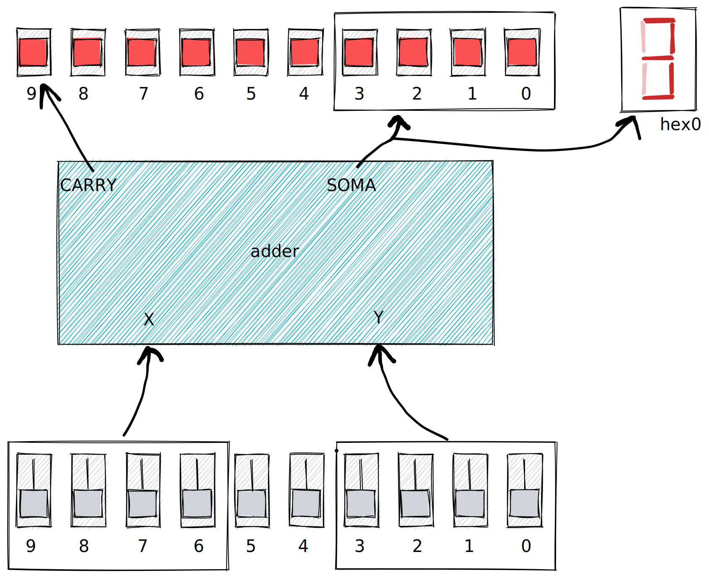

# Lab 6: Adders

Neste laboratório iremos desenvolver somadores que serão utilizados no desenvolvimento da unidade lógica aritmética da nossa CPU.

!!! info "💰 Laboratório com pontos"
    Algumas tarefas deste laboratório fornecem pontos de nota individual (hardware ou software), os exercícios marcados com 💰 são os que fornecem os pontos. Os pontos apenas são validados quando contabilizados pelo CI do github. Fiquem atentos para o deadline da entrega.
    
    Neste laboratório você pode receber até: **({{lab_6_points}})**.

!!! exercise
    1. Acesse o lab 6 pelo link {{lab_6_classroom}}
    1. Clone o repositório criado 
    1. Crie o ambiente virtual python (`python3 -m venv env`)
    1. Ative o ambiente virtual (`. env/bin/activate`)
    1. Instale as dependências (`pip3 install -r requirements.txt`)


## Half e Full adder 

Vamos começar implementando as duas unidades básicas de um somador: o *half-adder* e *full-adder*. 

!!! exercise
    - File: `ula_modules.py `
    - Modulo: `def halfAdder(a, b, soma, carry):`
    - Test: `pytest -k halfAdder`
 
!!! exercise
    - Modulo: `def fullAdder(a, b, c, soma, carry):`
    - Test: `pytest -k fullAdder`
    

### Reutilizando componente ( `Structural Modeling` )

!!! info
    Para mais detalhes acesse a documentação do MyHDL

    - http://docs.myhdl.org/en/stable/manual/structure.html

A modelagem estrutural em hardware pode ser entendida como a utilização de diferentes módulos para construir um novo. Lembre que estamos desenvolvendo um hardware e não criando um software, e que esse hardware deve ser sintetizável (possível de implementar na FPGA ou em ASIC). 

Para isso devemos criar "instancias" de um componente, por exemplo: Podemos criar uma instância do *halfAdder* e outra do *fullAdder* para implementarmos um somador de dois bits. Podemos pensar nessas instâncias como "ir até o armário do laboratório e pegar um CI de cada tipo", cada instância é executada em paralelo e consume recursos próprios, quanto mais instâncias mais complexo é o hardware e mais recursos são utilizados.

#### halfAdder

Como exemplo do processo vamos reimplementar o fullAdder, mas agora utilizando dois halfAdders, como demonstrado no diagrama a seguir:


O código em python fica:

``` py
@block
def fullAdder(a, b, c, soma, carry):
    s0 = Signal(bool(0)) # (1)
    s1 = Signal(bool(0)) 
    s2 = Signal(bool(0))

    half_1 = halfAdder(a, b, s0, s1) # (2)
    half_2 = halfAdder(c, s0, soma, s2) # (3)

    @always_comb
    def comb():
        carry.next = s1 | s2 # (4)

    return instances()
```

1. Sinais internos para conexão
2. Primeira instancia do half adder
3. Segunda instancia do half adder
4. Implementação da porta `or` entre as saídas dos `carrys` 

Notem que na implementação anterior utilizamos três sinais binários interno (`s0`, `s1` e `s2`) no módulo para a conexão entre os componentes e que a lógica do `OR` entre os carrys é implementada em um bloco combinacional `def comb`.

!!! exercise
    - Modulo: `def fullAdder(a, b, c, soma, carry):`
    - Test: `pytest -k fullAdder`

    Tarefa: 
    
    Modifique o fullAdder para utilizar dois hallAdders, execute o teste novamente e note que ele passa.

Podemos melhorar um pouco o código anterior se no lugar dos sinais `s0`, `s1` e `s2` criássemos um vetor de sinais `s[]` com três itens.

``` diff
- s0 = Signal(bool(0)) 
- s1 = Signal(bool(0)) 
- s2 = Signal(bool(0))
+ s = [Signal(bool(0)) for i in range(3)]
```

Com isso temos um vetor de bits `s` que pode ser endereçado como `s[0]`, `s[1]` e `s[2]`.

!!! tip
    O MyHDL possui um tipo próprio para tratar um vetor de bits (`intbv` ou `modbv`), mas por enquanto vamos usar o vetor criado por vários bools. A diferença entre os dois métodos é que no `intbv` os bits são interpretados como um único sinal (`unsigned` ou `signed`, como se fosse uma variável) e no vetor criado por `bools` os bits são independentes!

!!! exercise
    Modifique novamenge o `fullAdder`, mas agora usando um vetor de bits `s[]` no lugar dos três sinais `s0`, `s1` e `s2`.
    
    ??? solução
        ```python
        @block
        def fullAdder(a, b, c, soma, carry):
            s = [Signal(bool(0)) for i in range(3)]

            half_1 = halfAdder(a, b, s[0], s[1]) 
            half_2 = halfAdder(c, s[0], soma, s[2])

            @always_comb
            def comb():
                carry.next = s[1] | s[2]

            return instances()
        ```

## 💰 Somador (1 HW / 0 SW)

Agora com os dois módulos implementados podemos construir um somador mais completo, que soma dois vetores de bits. Para isso iremos precisar de um halfAdder (HA) e um fullAdders (FA) conectados da seguinte maneira:

```
           x1 y1                x0 y0
            |  |  /--------\     |  |
            |  |  |        |     |  |
          .-v--v--v--.     |  .--v--v----.
          | a  b  c  |     |  |  a  b    |
          |          |     |  |          |
 carry <---carry     |     <---carry     |
          |     soma |        |     soma |
          .--|-------.        .--|-------.
             |     FA            |      HA
             v                   v
            q1                  q0
```

Nessa ligação, estamos somando dois vetores de dois bits cada: `x[1..0] + y[1..0]` que resulta em uma soma de dois bits: `q[1..0]` e um `carry`.

``` py
@block
def adder2bits(x, y, soma, carry):
    # adder de 2 bits!
```

Onde `x`, `y` e `s` são vetores do tipo `bool` de duas posições.

!!! exercise
    Explique o que está acontecendo para o seu colega, você entendeu o porque dessa ligação e como ela funciona? 

!!! exercise "💰 Somador ({{lab_6_points}}), exercício "
    
    - Modulo: `def adder2bits(x, y, soma, vaiUm):`
    - Test: `pytest -k adder2bits`
    - Run: `./run_adder2bits.py`

    Tarefa: 
    
    - Modifique o `adder2bits` para implementar um somador de dois bits como demonstrado no diagrama anterior.
    - Teste com `pytest`
    - Você pode testar o módulo executando ele: `./run_adder2bits`. Você deve dar como entrada os valores de `x` e `y` em decimal. ==Lembre que para dois bits o valor máximo é 3==.

    <script id="asciicast-282J3aAGabeQLyhbSdTgGuRIB" src="https://asciinema.org/a/282J3aAGabeQLyhbSdTgGuRIB.js" async></script>

### Generalizando

O somador que criamos funciona apenas para vetores de dois bits, mas somos capazes de criar um módulo genérico que realiza a operação em N bits (N o tamanho dos vetores de entrada). Para isso deveremos usar um `for` que irá criar N instâncias do `FA` para atender a necessidade do tamanho das entradas.

Para isso será necessário criar uma lista de componentes, que será gerada com base no tamanho do vetor da soma. Vamos analisar como fazer isso com o exemplo do FA que utiliza dois halfAdders, para isso iremos criar uma lista do tipo `None` e então inicializar cada elementos dela com um halfAdder:

``` py
haList = [None for i in range(2)]  # (1)
```

Implementação fullAdder com lista de componentes fica assim:

``` py
@block
def fullAdder(a, b, c, soma, carry):
    s = [Signal(bool(0)) for i in range(3)]
    haList = [None for i in range(2)]  # (1)

    haList[0] = halfAdder(a, b, s[0], s[1]) 
    haList[1] = halfAdder(c, s[0], soma, s[2])

    @always_comb
    def comb():
        carry.next = s[1] | s[2]

    return instances()
```

1. Lista de dois componentes não inicializada 

!!! exercise
    - Modulo: `def fullAdder(a, b, soma, vaiUm):`
    - Test: `pytest -k fullAdder`
    
    Tarefa:
    
    Modifique o fullAdder para usar uma lista de componentes.
    
Agora que sabemos como podemos criar uma lista de componentes, podemos fazer a implementação do adder que se adapta a quantidade de bits que ele recebe. Isso é interessante pois podemos usar o mesmo adder instanciado de diferentes maneiras como um hardware dedicado para somar vetores de `2` bits, `8` ou quanto quisermos. Vamos ver mais para frente que a largura do somador é determinada pela arquitetura da CPU, já reparou que alguns programas quando você vai baixar possuem a opção `x64` ou `x86`? Isso determina entre outras coisas, qual a largura de dados da CPU em questão, `64` ou `32` bits.

!!! exercise
    - Modulo: `def adder(x, y, soma, carry):`
    - Test: `pytest -k adder`
    - Run: `./run_adder.py`

    Tarefa:

    - Implemente o módulo `adder` que é um somador genérico.
    - Teste com `pytest test_adder`

    Dicas:

    - Para saber o tamanho do vetor use `n = len(x)`
    - Crie uma lista de componente de tamanho `faList = [None for i in range(n)]` 
    - :pencil2:  Utilize caneta e papel, desenhe um módulo somador de tamanho 3 e tente depois generalizar. 
    - ==Tente apenas usar `fullAdder` na implementação==
    - Faça um loop para inicializar cada um dos componentes
    ``` py
    for i in range(n):
        faList[n] = fullAdder(x[i], ...)
    ```
    
## FPGA

Agora vamos executar o adder na FPGA! Vamos usar a implementação do `adder` genérico com 4 bits para o vetor `x` e 4 bits para o `y`, vamos mapear os bits para as chaves da FPGA e a saída do adder para os LEDs, o carry vai ser o último LED.

{width=400}

No `toplevel.py` eu estou usando o `bin2hex` do laboratório anterior para mostrar no display HEX0 o resultado da soma.

!!! exercise
    Modifique o `toplevel.py`:
    
    ``` py
    ic1 = adder(sw[0:4], sw[6:10], ledr_s[0:4], ledr_s[9])
    ic2 = bin2hex(HEX0, ledr_bin)
    ```

    1. Gerar o `toplevel.vhd` rodando `toplevel.py`
    1. Compile o vhdl
        - `make -C quartus clean`
        - `make -C quartus all`.
        - `make -C quartus program`
    1. Validar na FPGA 
